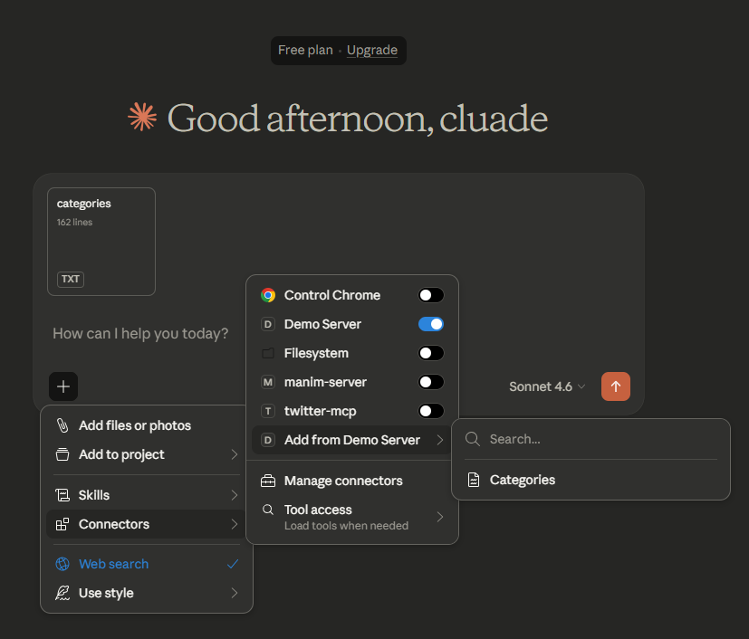
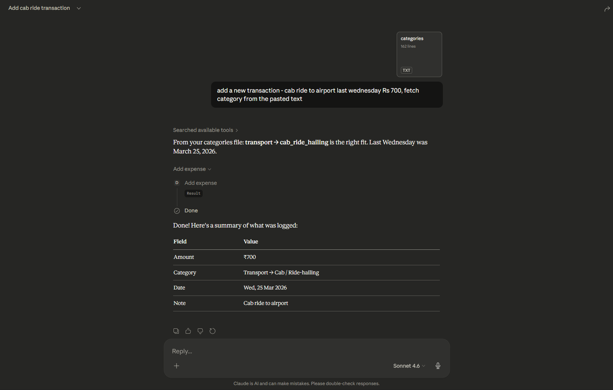

# Building a Deployed Expense Tracker MCP Server 

## Concept of Expense Tracker
The expense tracker MCP server accepts natural language inputs like:
- “Add milk expense of ₹20”
- “Show all expenses from September”

It can add entries, list them, and summarize totals or categories. Unlike traditional apps, this approach feels natural and conversational. A demo shows how it handles dates (“yesterday”), categories, and notes automatically.

**Key points:**
- Natural language interface makes expense tracking easier.
- Works in real time with a chatbot client (like Cloud Desktop).
- Can add, list, and summarize expenses quickly.

---

## Planning the Build and Understanding MCP Protocol
Before coding, the plan is to start with a simple MCP server (like a dice roller) to understand setup, running, and client integration.

MCP is a protocol (set of rules). Writing servers from scratch is complex, so we use libraries. Two main options are:
- MCP SDK (official library)
- FastMCP (simplified abstraction)

**Key points:**
- MCP SDK is powerful but verbose.
- FastMCP makes development much easier.

---

## Evolution of MCP Libraries
- MCP was introduced by Anthropic in 2023.
- The first SDK was too boilerplate-heavy.
- FastMCP (by Jeremiah Lowin) simplified it, like Keras simplified TensorFlow.
- FastMCP was later integrated into the SDK but also exists independently.

**Key points:**
- SDK had sub-libraries (server, client, CLI).
- FastMCP became the developer-friendly choice.

---

## Current State of Libraries
Today, developers can choose:
- MCP SDK with its tools.
- FastMCP 3.0 as an independent, simpler option.

We uses FastMCP as it’s the preferred, future-ready choice.

---

**Key points:**
- Use uvicorn (uv) for running MCP servers.
- Write Python functions decorated as MCP tools.
- Debug with MCP Inspector.
- Connect to Cloud Desktop for real-time interaction.

---

## Developing the Expense Tracker Server
The main project implements three tools:
- Add Expense – save amount, date, category, note.
- List Expenses – fetch entries, optionally filter by dates.
- Summarize Expenses – totals by category or range.

Data is stored in SQLite (expenses.db). The database schema includes ID, date, amount, category, subcategory, and notes.

**Key points:**
- SQLite is simple and good for local storage.
- Tools wrap SQL commands in MCP functions.
- Features are added incrementally: add → list → filter → summarize.

---

## Improving Consistency with Resources
Problem: users may type inconsistent categories (“Education” vs “Upskilling”).

Solution: create a JSON resource listing valid categories/subcategories. Clients can pull from this list to enforce uniform data.

**Key points:**
- Resources prevent messy category data.
- JSON file exposed via MCP resource decorator.

---

## Expanding Features
Suggested enhancements:
- Edit or delete expenses.
- Add income/credits.
- Budget tracking.

This could evolve the project into a complete personal finance app.

---

## FastAPI and MCP Integration
FastMCP borrows ideas from FastAPI and works seamlessly with it.
- A FastAPI app can be turned into an MCP server with minimal code.
- This is useful for companies that already use FastAPI backends for multi-platform apps.
- Instead of building new logic, they can extend their existing backend to support MCP clients like Cloud Desktop.

**Key points:**
- FastMCP ↔ FastAPI compatibility.
- Reuse existing APIs for MCP servers.
- Saves time and avoids duplication.

---

## Key Takeaways
- MCP enables AI → app communication.
- Libraries (MCP SDK & FastMCP) simplify server building.
- Expense tracker demo shows natural language input for finance management.
- JSON resources ensure clean, consistent data.
- MCP Inspector is essential for debugging.
- FastMCP integrates with FastAPI → great for companies.
- Roadmap: local server → remote production server.

---